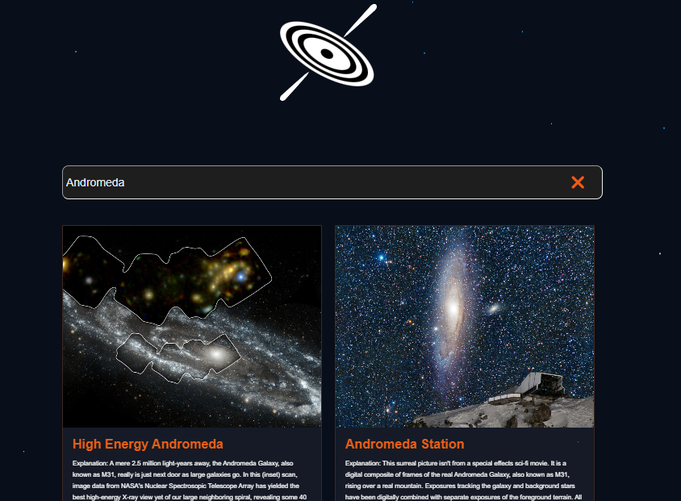

# Andromeda: A Django and ElasticSearch Project

**Andromeda** is a Django and ElasticSearch-powered web application designed to practice and showcase ElasticSearch integration. It features a multi-match query search functionality, allowing users to search across multiple fields for relevant results. Built as a learning project, Andromeda demonstrates how to combine Django's backend capabilities with ElasticSearch's powerful search engine.

## Demo

## Features
- **Multi-Match Search**: Implements ElasticSearch's multi-match query to search across multiple fields (e.g., title, description) for relevant results.
- **Dynamic Search Interface**: A user-friendly interface for entering search queries and viewing results.

## Technologies Used
- **Backend**: Django (Python)
- **Search Engine**: ElasticSearch
- **Frontend**: HTML, CSS, JavaScript
- **Deployment**: Docker and Docker Compose

## Key Learnings
- Integrating ElasticSearch with Django for advanced search functionality.
- Indexing a JSON dataset in Bulk into ElasticSearch
- Building and optimizing multi-match queries for better search results.

## Future Improvements 
- Implement semantic search using embeddings and vector-based search.
- Explore k-nearest neighbors (k-NN) for similarity-based search.
- Add hybrid search combining keyword and semantic search.